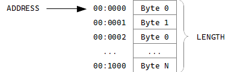
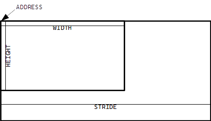

---

author: PJW

date: 19 March 2021

title: The Basic816 Language Manual

---

# About Basic816

Basic816 is an implementation of the BASIC programming language for the
Western Design Center's 65816 microprocessor. It is focused on providing
a simple BASIC interpreter for the C256 Foenix computer designed by
Stefany Allaire. Basic816 has a few design goals and even a couple of
anti-goals:

-   It should provide a retro-computing feel.

-   It should be simple to use and easy to learn.

-   It should provide essential access to storage and the C256's
    abilities.

-   It should be expandable, allowing advanced users to customize it or
    extend it.

-   It should be a clean-room implementation, unencumbered by
    copy-right.

-   It need not be the fastest programming language available.

-   It need provide all the advancements in programming languages
    developed since the 1980s.

As such, Basic816 is a fairly traditional, tokenized, line-number based
implementation of BASIC, similar to those implementation of BASIC on the
8-bit computers of the 1970s and 1980s.

# Screen Editing

BASIC816 for the C256 includes a simple screen editor. To enter a
program, just type the lines, being sure to press the return key at the
end of each line. The interpreter will not attempt to process the line
until you press return, and the text it will process is whatever text is
on the line of the screen where your cursor is. If you need to edit a
line that's on the screen, you can use the cursor keys to move to the
line and make your change. A few other special keys are supported:

-   The arrow keys will move the cursor on the screen in a natural
    fashion.

-   The backspace key deletes the character to the left of the cursor.

-   The delete key deletes the character under the cursor.

-   The insert key inserts a space at the cursor (pushing the character
    that was under the cursor to the right).

Although not an edit key, the SysRq key is currently assigned as a
"programmer's key" and will interrupt the currently running BASIC
program and open the monitor. It should work for any program (even
machine language), so long as the keyboard interrupt logic has not been
intercepted. Likewise, the Scroll Lock key will pause any screen output
from the interpreter while it is on. This includes output from a program
that is producing a lot of text and even program listings.

# Data Types

Basic816 supports three data types:

-   The integers in Basic816 are 32-bit signed integers and may have
    values from `-2,147,483,648` to `2,147,483,647`. Examples of
    integers are `0`, `1`, `42`, `-1`, `-128`.

-   The floating point numbers in Basic816 are 32-bit floating points
    using the IEEE-754 format, which uses an 8-bit exponent, a 23-bit
    mantissa, and a single sign bit. Given a mantissa of *m* and an
    exponent of *x*, the value of the floating point number is
    *m(2^x)*. Floating point numbers in Basic816 are represented
    in one of two ways, either as a decimal number or using scientific
    notation: `1.0`, `-23.45`, `1.0e-03`, `3.0e08`.

-   Text data are stored in strings. A string may be entered into a
    Basic816 program by enclosing it in double quote marks. Strings are
    represented internally as null-terminated ASCII strings, that is,
    there is no length data on the string, the end of which is marked by
    a 0 byte. Strings may be up to 65536 bytes in length.

-   Arrays allow multiple data items to be stored under a single name
    and accessed by an index. Two types of arrays are supported: arrays
    of integer and arrays of strings. Arrays may be just
    one-dimensional, using a single number as index, or they may be
    multi-dimensional, where each element has a unique combination of
    numbers serving as an index.

Unlike many implementations of BASIC, Basic816 treats floating point
numbers differently from integer numbers. Operations on integer values
or integer variables are performed using integer code and result in an
integer value. Operations on floating point values or variables are
performed using floating point code and result in a floating point
value. On the C256, integer code generally uses the integer math
coprocessor, while floating point code uses the floating point math
coprocessor. Integers and floating point numbers can be converted
between each other. If an operation is expecting a floating point value,
the interpreter will attempt to convert an integer to floating point. If
it is expecting an integer, it will attempt to convert a floating point
value to an integer. One caveat to converting between integers and
floating point numbers is that Basic816 integers have 32-bits of
precision, but the floating point numbers have only 23 bits of precision
for the mantissa.

## Literal Values

Integers, floats, and strings may be entered directly into programs as
literal values. Strings are designated with double quote marks, but
there is no character escape syntax as in other languages. If you need
to enter a character you cannot type, you will have to use the `CHR$`
function. Integers may be entered as a sequence of digits with an
optional minus sign at the start. The default base for integers is
decimal, but hexadecimal numbers may be entered with the `&H` prefix.
Floating point numbers may only be entered using decimal digits and must
include a decimal point.

-   `"Hello, world!"`

-   `12345`

-   `-562`

-   `&HFFD2`

# Variables

A Basic816 program can assign data to variables using the `LET`
statement or an implicit `LET` statement. Variables need not be declared
before use, with the exception of array variables, which must be
declared through the `DIM` statement.

Variable names may be up to eight characters long. The first character
must be an alphabetic character from A through Z. Subsequent characters
of the name may be A--Z, 0--9, or the underscore character (\_). The
type of the variable is indicated by a character at the end of the
variable name. Integer variables are indicated by the percent sign (%),
and string variables are indicated by the dollar sign (\$). Floating
point variables have no type character. These type designations must be
used in all references to the variable and may be considered as part of
the name. This means that a program can have six different variables
with the same "name" but different types (e.g. `A`, `A%`, `A$`, `A()`,
`A%()`, and `A$()`).

# Expressions

An expression is a sequence of values, operators, and function calls
which will have some data value as a *result*. An expression may have a
numeric (integer) result or a text (string) result.

Operators are common mathematical symbols which will perform some sort
of computation on two values. These are the usual sort of thing:
addition, subtraction, multiplication, division, and so on. Operators
are typically evaluated left to right, but have an operator precedence
which can alter the order of execution. For instance multiplication
operators are evaluated before addition. This precendence can be altered
by using parentheses to enclose a sub-expression that should be
evaluated as a unit.

#### Operators in order of descending precedence
| Operators                        |  Purpose                 |
|----------------------------------|--------------------------|
|`^`                               | Exponent                 |
|`*`, `/`, `MOD`                   | Multiply, Divide, modulo |
|`+`, `-`                          | Addition, Subtraction    |
|`<`, `>`, `=` , `<=`, `>=`, `<>`  | Comparison operators     |
|`NOT`                             | Bitwise Negation         |
|`AND`                             | Bitwise AND              |
|`OR`                              | Bitwise OR               |

NOTE: the division operator performs a floating point division always
results in a floating point value, even if the numerator and denominator
are divisible.

# Commands

Commands in Basic816 are keywords which triggers some action but which
may only be used at the interactive prompt. Commands may not be used
within a Basic816 program.

## `CONT`

Continue execution of the current program from the point immediately
after the `STOP` statement that was executed. It is an error to use this
command if the current program was not interrupted by the `STOP` command
or if there is no current program.

## `DIR`

Print a listing of the files on the current file device.

## `DEL` `<filename>`

Delete a file from a file device.

## `NEW`

`NEW` clears all of Basic816's memory. All program and variable data are
erased, and a new program may be entered.

## `LIST [<start>] [- <end>]`

`LIST` types a program listing to the console screen. It accepts two
optional line-numbers to limit the listing. The first line number
specifies the smallest line number to list; if it is not specified,
there is no lower limit. The second line number specifies the largest
line number to list; if it is not specified, there is no upper limit.

## `LOAD` `<filename>`

Load the BASIC program with the given file name.

## `SAVE` `<filename>`

Save the BASIC program to storage with the given file name. The file
must not already exist.

## `RUN`

Starts execution of the program from the first line of the code.

# Statements

Statements are keywords which trigger some action and may be used either
at the interactive prompt or within a program. A Basic816 program can be
seen as a series of lines, each of which must have one or more
statements on it. If a line has more than one statement, each statement
is separated from the next by a colon (:).

## `BLOAD` `<filename>` \[, `<destination>`\]

Loads a binary file into memory starting at the specified
`<destination>` address in memory. If there is no provided
`<destination>`, the file format loaded must have its own destination
address embedded within it. Currently, only the `PGX` format is
supported, but others may be supported in future.

## `BRUN` `<filename>`

Load the binary file specified into memory and attempt to execute it.
The file must be in an executable format, which means that it must
contain its own destination address and information on how to start it.
Currently, only the `PGX` format is supported, but others may be
supported in the future.

## `BSAVE` `<filename>`, `<start>`, `<end>`

Save the data in memory from address `<start>` to address `<end>`
(inclusive) to a binary file. The file must not already exist.

## `CLR`

Erases all variable definitions. Any variable that was defined prior to
the use of `CLR` will be undefined. Also all data stored directly or
indirectly through variables will be returned to free memory. This is
similar to `NEW`, except that the program may be running and is left
intact.

## `CLS`

Clears the text screen and moves the cursor to the home position.

## `CALL <address>[, <a>[, <x>[, <y>]]]`

Call a machine language subroutine at `<address>`. If the subroutine
returns at all to the caller, it must return using the `RTL`
instruction. Values may be provided for the `A`, `X`, and `Y` registers
and may be 16-bit values.

## `DATA <value>[, ...]`

Provide numeric or string data in the program which may be retrieved
into a variable using the `READ` statement.

## `DEL` `<filename>`

Delete a file from the storage device.

## `DIM <variable>(<size>[, ...])`

Declare an array named `<variable>`. The array can have many dimensions,
each with the size provided. An array can have up to 127 dimensions, and
the size can be up to 256, but in practice the entire block of memory
consumed by the array cannot exceed 65,536 bytes (including the "book
keeping" memory allocated to keep track of the array (which is at most
256 bytes).

## `END`

Stops execution of the program. The only way to restart execution after
`END` has been executed is to use the `RUN` command.

## `FOR` `<variable>` = `<initial>` `TO` `<target>` \[`STEP` `<increment>`\]

The `FOR` statement marks the beginning of a loop that will repeat a
specified number of times. It starts by assigning an `<initial>` value
to a `<variable>` and executing the following statement until the
matching `NEXT` statement is encountered. It will then either add 1 to
`<variable>` or `<increment>`, if provided. So long as `<variable>` is
not `<target>`, the statements between the `FOR` and `NEXT` will be
executed.

## `GET` `<variable>`

Waits for the user to press a key, the assigns the character of that key
to the string `<variable>` provided.

## `GOTO` `<line number>`

Continue execution with the first statement on the line with the given
`<line number>`. It is an error to `GOTO` a `<line number>` that does
not exist in the program.

## `GOSUB` `<line number>`

Call a subroutine starting at the line with the given `<line number>`. A
subsequent `RETURN` statement will return the program to the statement
following the `GOSUB`. It is an error to `GOSUB` a `<line number>` that
does not exist in the program.

## `IF` `<expr>` `THEN` `<line>`

Evaluates `<expr>` and examines the result. If the result is not zero,
execution continues with the first statement on the line with number
`<line>`. Otherwise, execution continues with the next statement after
the `IF`.

Note: This statement will be receiving considerable improvements in
subsequent versions of Basic816.

## `INPUT` \[ `<message>`; \] `<variable>`

If a literal string message is provided, print the message followed by a
question mark. If no message is provided, just print a question mark. In
either case, wait for the user to type a line of input on the keyboard
and put the value typed into the provided variable.

NOTE: Currently, this statement supports only string values and
variables.

## `NEXT`

Close the matching `FOR` loop.

## `POKE` `<address>`, `<value>`

Write the 8-bit `<value>` to the memory location at `<address>`. It is
an error to try to write a value that requires more than 8-bits.

## `POKEW` `<address>`, `<value>`

Write the 16-bit `<value>` to the memory location at `<address>`. The
low byte of `<value>` will be written to `<address>`, and the high byte
of `<value>` will be written to the following byte in memory. It is an
error to try to write a value that requires more than 16-bits.

## `POKEL` `<address>`, `<value>`

Write the 24-bit `<value>` to the memory location at `<address>`. The
low byte of `<value>` will be written to `<address>`, and the middle
byte of `<value>` will be written to the following byte in memory, and
the high byte of `<value>` will be written to the next byte in memory.
It is an error to try to write a value that requires more than 24-bits.

## `PRINT` \[`<value>` \[,/;\]\] \...

Write the textual representation of `<value>` to the screen. If more
than one `<value>` is provided, they must be separated by either a comma
(,) or a semicolon (;). If a comma is used, the two items will be
separated by a TAB. If a semicolon is used, the two items will be
printed one after the other. A `PRINT` statement will print a carriage
return as the last thing, unless the statement is ended with a
semicolon.

## `REM` `<comment>`

Inserts a comment into the Basic816 program. All characters after the
`REM` until end of the line will be ignored.

## `READ` `<variable>`\[, \...\]

Read one of more values out of the `DATA` statements in the program into
`<variable>`. The data read must have a compatible type to the variable.
Each variable read will advance a data cursor forward one data element.
If a `READ` is executed when the cursor has reached the end of the data
elements, it is an error.

## `RENAME` `<path>`, `<filename>`

Renames the existing file at `<path>` to `<filename>`.

## `RESTORE`

Resets the data cursor to the first data element of the first `DATA`
statement.

## `STOP`

Stops execution of the program in such a way that the user can restart
it with the `CONT` command.

# Functions

## `ABS(<value>)`

Returns the absolute value of `<value>`. If the parameter is negative,
it is converted to its positive equivalent (for instance, `ABS(-5)` will
evaluate to `5`).

## `ASC(<text>)`

Returns the ASCII code for the first character of `<text>`. Example:
`ASC("A")` returns `65`.

## `CHR$(<value>)`

Returns the character corresponding to the ASCII code in `<value>`.
Example: `CHR$(65)` returns `"A"`.

## `COS(<value>)`

Returns the cosine of `<value>`, which should be in radians.

## `DEC(<hex>)`

Returns an integer that is conversion of the hexadecimal number in the
string `<hex>`. Example: `DEC("A0") ` returns `160`.

## `HEX$(<value>)`

Returns a string that is the hexadecimal representation of the integer
value passed. Example: `HEX$(160) ` returns `"A0"`.

## `INT(<value>)`

Converts a floating point `<value>` to an integer by truncating the
fractional part. The value returned is of integer type.

## `LEFT$(<text>, <count>)`

Returns the left-most `<count>` characters of the string `<text>`.

Example: `LEFT$("Hello", 3)` returns `"Hel"`.

## `LN(<value>)`

Returns the natural logarithm (base $e$) of `<value>`.

## `MID$(<text>, <first>, <count>)`

Returns a substring of the string `<text>`. The parameter `<first>`
specifies the number of the first character to use, where a `0` is the
number of the first character in the source string. The parameter
`<count>` indicates how many characters should be returned.

Example: `MID$("Hello", 2, 3)` returns `"llo"`.

## `PEEK(<address>)`

Returns the byte stored in memory at location `<address>`.

## `PEEKW(<address>)`

Returns the 16-bit word stored in memory at location `<address>`. The
low byte of the returned value is at `<address>`, and the high byte is
at `address + 1`.

## `PEEKL(<address>)`

Returns the 24-bit word stored in memory at location `<address>`. The
low byte of the returned value is at `<address>`, the middle byte is at
`address + 1`, and the high byte is at `address + 2`.

## `RIGHT$(<text>, <count>)`

Returns the right-most `<count>` characters of the string `<text>`.

Example: `LEFT$("Hello", 3)` returns `"llo"`.

## `RND(<value>)`

Returns a pseudo-random floating point number between 0.0 and 1.0. Note
that the input value is not used and can be any number.

## `SGN(<value>)`

Returns the sign of the number `<value>`. If the number is negative, the
result is `-1`, if the number is positive, the result is `1`, and if the
number is zero, the result is `0`.

Example: `SGN(-25)` returns `-1`.

## `SIN(<value>)`

Returns the sine of `<value>`, which should be in radians.

## `SPC(<value>)`

Returns a string containing `<value>` spaces.

Example: `SPC(5)` returns a string of five spaces.

## `STR$(<value>)`

Returns a string containing the decimal representation of the number
`<value>`.

Example: `STR$(25)` returns `"25"`.

## `TAB(<value>)`

Returns a string containing `<value>` TAB characters.

Example: `TAB(2)` returns a string of two TABs.

## `TAN(<value>)`

Returns the tangent of `<value>`, which should be in radians.

## `VAL(<text>)`

Returns the numeric value represented by the string of decimal digits in
`<text>`.

Example: `VAL("42")` returns `42`.

# C256 Specific Statements

Basic816 includes a number of statements to support features of the C256
Foenix.

## `BITMAP` `<plane>`, `<visible>`, `<lut>` \[, `<address>`\]

Controls the visibility of the bitmap display (the bitmap engine must be
enabled with the `GRAPHICS` command). The parameter `<visible>` must be
a number. If it is 0, the bitmap will be hidden. If it is any other
value, it will be shown.

The number of the color lookup table to use must be provided as `<lut>`,
which must be the number of one of the graphics color lookup tables.

Optionally, an address may be provided for the first byte of the bitmap.
This address must be in the video memory starting at 0xB00000. If no
address is provided, the it will default to 0xB00000.

## `CLRBITMAP` `<plane>`

Sets all pixels in the bitmap to 0 (transparent). `<plane>` is the
number of the bitmap plane (0 or 1). The bitmap must have been setup
with the `BITMAP` statement before this statement can be used.

## `FILL` `<plane>`, `<x0>`, `<y0>`, `<x1>`, `<y1>`, `<color>`

Fill the rectangle with corners at $(x_0, y_0)$ to $(x_1, y_1)$ with the
color specified by the `<color>` index number. `<plane>` is the number
of the bitmap plane (0 or 1). The actual color displayed will depend on
the RGB values provided for that index in the color lookup table
currently used by the bitmap. The `BITMAP` statement must have been used
before using this statement.

## `GRAPHICS` `<mode>`

Sets the graphics mode of the Vicky chip. This statement just sets the
master control register of the Vicky chip to whatever value is provided
in `<mode>`, which should be a number in the range 0--255.

The bits of the master control register can be seen described in
Table [1](#vicky-master-control-regiser).

#### Vicky Master Control Regiser
| Bit | Purpose                                                             |
|-----|---------------------------------------------------------------------|
| 9   | Pixel Double: 0 = use base resolution, 1 = use half base resolution |
| 8   | Base Resolution: 0 = 640x480, 1 = 800x600                           |  
| 7   | Global disable: If set, this disables all Vicky output.             |  
| 6   | Gamma Correction: If set, this enables gamma correction.            |  
| 5   | Sprites: If set, this enables the sprite engine.                    |  
| 4   | Tiles: If set, this enables the tile engine.                        |  
| 3   | Bitmap: If set, this enables the bitmap engine.                     |  
| 2   | Graphics: If set, this enables the graphics blocks.                 |  
| 1   | Text Overlay: If set, text will be displayed over graphics.         |  
| 0   | Text: If set, this enables the text display engine.                 |  

One of the big changes with VICKY II is support of multiple display
resolutions: 320x240, 400x300, 640x480, 800x600. The resolution is set
using bits 8 and 9 of the master control register. Bit 8 sets the base
resolution by setting the display clock frequency, and bit 9 turns on
and off the pixel doubler. These resolution bits affect text as well as
graphics rendering. So, choosing mode `&h101` will switch to a high
resolution text mode with up to 100 characters per row (if the border is
turned off).

#### Vicky Display Resolutions
| Bit 9 | Bit 8 | Resolution        |
|-------|-------|-------------------|
| 0     | 0     | 640x480 (default) |
| 0     | 1     | 800x600           |
| 1     | 0     | 320x240           |
| 1     | 1     | 400x300           |

## `LINE` `<plane>`, `<x0>`, `<y0>`, `<x1>`, `<y1>`, `<color>`

Draw a line on the bitmap display from positions $(x_0, y_0)$ to
$(x_1, y_1)$ in the color specified by the `<color>` index number.
`<plane>` is the number of the bitmap plane (0 or 1). The actual color
displayed will depend on the RGB values provided for that index in the
color lookup table currently used by the bitmap. The `BITMAP` statement
must have been used before using this statement.

`<plane>` is the number of the bitmap plane (0 or 1).

The number of the color lookup table to use must also be provided as
`<color>`, which must be the number of one of the graphics color lookup
tables.

## `LOCATE` `<column>`, `<row>`

Move the text cursor to the specified `column` and `row` on the text
screen. Both arguments may be from 0 to 255, but no attempt is made to
validate that the coordinates are valid for the current text mode.

## `MONITOR`

Enter the machine language monitor.

## `MEMCOPY` `<source>` `TO` `<destination>`

Request a copy of one block of memory to another block using the C256's
DMA capabilities. In the C256, DMA transfers can work with two different
memory topologies. A block of memory to be copied can be a linear (or
"1D") block of contiguous bytes, or it can be a rectangular (or "2D")
block of bytes, which can be a smaller region of a larger rectangular
block. An example of this latter topology is when a program wants to
copy a 32 pixel by 32 pixel block out of a 640 by 480 image.

In order to specify the block topology, `<source>` and `<destination>`
must use one of two forms:

`LINEAR` `<address>`, `<length>`

:   This structure specifies that the block is 1D or linear and starts
    at `<address>` and consists of `<length>` contiguous bytes. (See:
    Figure [1](#memcopy_1d){reference-type="ref"
    reference="memcopy_1d"})

`RECT` `<address>`, `<width>`, `<height>`, `<stride>`

:   This structure specified that the block is a 2D or rectangular
    block. The block starts at `<address>` and is `<width>` bytes wide
    and `<height>` bytes high. The block is part of a potentially larger
    rectangular "image" that is `<stride>` bytes wide. (See:
    Figure [2](#memcopy_2d){reference-type="ref"
    reference="memcopy_2d"})

{#memcopy_1d}

{#memcopy_2d}

Within certain limits, source and destination can use two different
memory topologies, so the structures of source and destination do not
need to match. An example where this might be useful is when a program
loads a small icon file that is 32 by 32 pixels and then copies it to
video RAM for display on a 640 by 480 screen:

    MEMCOPY LINEAR &h010000, 1024 TO RECT &hB00000,32,32,640

This statement will copy a 32 by 32 pixel image starting at 0x010000 to
0xB00000 as a 32 by 32 block in a larger 640 by 480 image.

There are two system limitations involving the addresses involved. The
C256 has two different types of RAM: system RAM, and video RAM. System
RAM (SRAM) is that memory from 0x000000 to 0x3FFFFF and can be used for
all code and data. This memory is not directly accessible by the
graphics subsystem, however. Video RAM (VRAM) is that memory from
0xB00000 to 0xEFFFFF and is exclusively for the graphics subsystem. All
graphical data to be displayed must be placed in this block of memory.

Any memory copy involving SRAM involves stopping the CPU for the
duration of the copy. This means any `MEMCOPY` transferring blocks
between SRAM addresses, from SRAM to VRAM, or from VRAM to SRAM will
halt the processor while the transfer is happening. While transfers will
be quick, the C256 will not be able to service interrupts while this is
happening. VRAM to VRAM transfers, do not stop the processor so
interrupts can still be processed (although the BASIC program will still
pause while the transfer is happening).

Another limitation is that while transfers between the two different
memories can use different memory topologies as shown above, transfers
within a single memory type have to use the same memory topology. For
example, the following statement is legal:

    MEMCOPY LINEAR &h010000, 1024 TO LINEAR &h020000, 1024

But this statement will result in an Illegal Argument error, since it is
trying to use two different memory topologies within the same type of
memory (SRAM in this case):

    MEMCOPY LINEAR &h010000, 1024 TO RECT &h020000, 32, 32, 640

## `PLOT` `<plane>`, `<column>`, `<row>`, `<color>`

Set the pixel at the specified `<row>` and `<column>` to the color with
the given `<color>` index number. `<plane>` is the number of the bitmap
plane (0 or 1). The actual color displayed will depend on the RGB values
provided for that index in the color lookup table currently used by the
bitmap. The `BITMAP` statement must have been used before using this
statement.

## `SETBGCOLOR` `<red>`, `<green>`, `<blue>`

Sets the background color to be used in graphics modes. The color is
specified as red, green, and blue components, all of which must be in
the range 0 - 255.

## `SETBORDER` `<visible>` \[, `<red>`, `<green>`, `<blue>` \]

Sets the visibility and, optionally, color of the border of the C256's
screen, given `<red>`, `<green>`, and `<blue>` intensity values, which
must be between 0 - 255. The parameter `<visibility>` must be a number:
if it is 0, the border will not be shown; if it is any other number, the
border will be visible.

## `SETDATE` `<day>`, `<month>`, `<year>`

Sets the date on the C256's real time clock, given the date as three
numbers: `<day>`, `<month>`, and `<year>`. The day number must be from
1 - 31. The month number must be from 1 - 12. The year number must be from
0 - 99.

## `SETCOLOR` `<lut>`, `<color>`, `<red>`, `<green>`, `<blue>`

Define the RGB intensities for a color in one of the Vicky chip's color
lookup tables. The color lookup table is a number `<lut>` in the range
0 - 9. The number of the color to change is `<color>`, which is in the
range 0 - 255 for all graphics lookup tables and 0 - 14 for the two text
mode lookup tables. The RGB intensities are provided by the parameters
`<red>`, `<green>`, and `<blue>`, which must be in the range 0 - 255.

The association of `<lut>` number to the color lookup table in Vicky is
shown in Table [3](#color-lookup-table-numbers).

#### Color lookup table numbers
| LUT  | Lookup Table         | Max Color  |
|------|----------------------|------------|
| 0    | Graphics LUT 0       | 255        |
| 1    | Graphics LUT 1       | 255        |
| 2    | Graphics LUT 2       | 255        |
| 3    | Graphics LUT 3       | 255        |
| 4    | Graphics LUT 4       | 255        |
| 5    | Graphics LUT 5       | 255        |
| 6    | Graphics LUT 6       | 255        |
| 7    | Graphics LUT 7       | 255        |
| 8    | Text Foreground LUT  | 15         |
| 9    | Text Background LUT  | 15         |

## `SETTIME` `<hour>`, `<minute>`, `<second>`

Sets the time on the C256's real time clock, given the time as three
numbers: `<hour>`, `<minute>`, and `<second>`.

## `SPRITE` `<number>`, `<lut>` \[, `<address>` \]

Set the color lookup table and the address for sprite `<number>`. The
parameter `<lut>` must be the number of the graphics lookup table the
sprite should use (0--7). The optional parameter `<address>` would be
the first byte of the sprite's bitmap data and must be an address in the
video RAM (starting at address B00000). If no address is provided, the
sprite will default to B00000.

## `SPRITEAT` `<number>`, `<column>`, `<row>`

Sets the location of a sprite. The sprite to move is `<number>`. Its
upper-left corner will be set to `<row>` and `<column>`.

## `SPRITESHOW` `<number>`, `<visible>` \[, `<layer>` \]

Controls the visibility of sprite `<number>`. If `<visible>` is 0, the
sprite will not be visible. If it is any other number, the sprite will
be visible. Optionally, the display priority `<layer>` may be set, which
will control which sprites and tiles this sprite will display in front
of or behind when they overlap.

## `TEXTCOLOR` `<foreground>`, `<background>`

Sets the color for text to be printed. The foreground color index is
specified by `<foreground>`, and the background color index is specified
by `<background>`. Both values must be in the range 0 - 15.

## `TILEAT` `<number>`, `<x>`, `<y>`

Sets the window and scroll position for a tile map. `<number>` is the
number of the tile set or tile map (0--3). `<x>` is the horizontal
window and scroll position. `<y>` is the vertical window and scroll
position.

The window and scroll positions are handled with a bitfield, and not a
true number:

#### Tile map window position and scrolling
| Bits   | Purpose    | Reading                           |
|--------|------------|-----------------------------------|
| 15     | Direction  | 1 = Left/Up, 0 = Right/Down       |
| 13 - 4  | Position   | Window offset in columns or rows  |
| 3 - 0   | Scroll     | Smooth scroll amount (in pixels)  |

## `TILESET` `<number>`, `<lut>`, `<is_square>`, `<address>`

Sets the bitmap to use for a tile map. The pixel data for each tile
comes from the tileset.

`<number>` is the number of the tile set or tile map (0--3). `<lut>` is
the number of the color look up table the tile set uses (0--7).
`<is_square>` is a boolean indicating if the tiles are laid out on a 256
by 256 pixel image (true) or 8 by 2,048 pixels (false). `<address>` is
the address of the first byte of the tile set, which must be somewhere
in video RAM.

## `TILEMAP` `<number>`, `<columns>`, `<rows>`, `<address>`

Sets the tile map to use. The tile map indicates which tile is displayed
at each position on the screen. The actual bitmap to be displayed for
each tile comes from the tile set.

`<number>` is the number of the tile set or tile map (0--3). `<columns>`
is the number tiles across in the tile map. `<rows>` is the number of
tiles vertically in the tile map. `<address>` is the address of the
first byte of the tile map, which must be somewhere in video RAM.

Note that the tile map may be considerably bigger than the screen both
horizontally and vertically. The Vicky II chip allows for smooth
scrolling in both directions across the whole map. Also, each tile takes
two bytes in the tile map. The lower byte is the number of the tile. The
upper byte specifies which tile set the tile comes from.

## `TILESHOW` `<number>`, `<is_visible>`

Controls whether or not a tile map is visible.

`<number>` is the number of the tile set or tile map (0--3).
`<is_visible>` is a boolean controlling whether or not the tile map is
visible. If 0, the tile map is invisible. If any other number, the tile
map is visible.

# C256 Specific Functions

## `GETDATE$(0)`

Returns the current date from the C256's real time clock as a string in
`"DD:MM:YY"` format.

## `GETTIME$(0)`

Returns the current time from the C256's real time clock as a string in
`"HH:MM:SS"` format.

# File Format: PGX

The C256 Foenix supports a simple executable format: PGX. This format is
intended as an elaboration on the PRG format from the Commodore
computers in that it provides for a single block of data to load
starting from an included destination address. To support the 65816 (and
possibly other processors), it uses a 32-bit address field and has a
signature and target CPU preamble. The first three bytes are the
signature in ASCII: \"PGX\". The next byte is the target version and
CPU, where the upper 4-bits is the version of the file format, and the
lower 4-bits is the CPU code. Currently, the only CPU supported is 1 for
65816. The next four bytes are the starting destination address. The
rest of the bytes in the file are the data to load. See
table [5](#pgx-file-format).

#### PGX File Format
| Offsets  | Value    | Purpose                 |
|----------|----------| ------------------------|
| 0 - 2    | "PGX"    | Type signature          |
| 3        | 0x01     | Target version and CPU  |
| 4 - 7    | address  | Destination address     |
| 8 -      | data     | Data to load            |

# Proposed: Extentions

The following is a proposal for an extension mechanism Basic816 may
provide in the future. It is not currently implemented in the
interpreter.

While Basic816 allows a program to use `CALL` to run any machine code
loaded into memory, this does not extend the language. For more complex
integration of machine language and BASIC, the interpreter will allow
for the program to load a binary file containing code for extending the
commands, statements, and functions of the interpreter. An extension may
be loaded with the statement:

    EXTENSION <path>        

Executing this statement will load the extension file off the storage
device, given its path. The statement will also implicitly execute a
`CLR` statement, removing all variable definitions and heap storage
objects. The reason for this is that the extenstions will be loaded into
what would be the top of the heap, and the heap will need to be moved
down to accomodate the extension. Therefore, if a program needs to use
an extension, the first thing it should do is to load the extension.

Note that multiple extensions can be loaded at one time. The interpreter
will assign an extension token sequence to each keyword defined by the
extensions. Since multiple extensions can be used, the token sequence
can vary from program to program. That means that if an extension
provides a statement `PLAY`, it might have the token \$F1 in one
program, but in another program, it might have the token \$F8.

## Coding an Extension

An extension will be a binary file on a storage device (SD Card, floppy
disk, hard drive). Each extension will be loaded into its own memory
bank of 64KB. The extension will have free use of all memory within that
bank for whatever purpose it desires. The beginning of that memory bank
must be laid out in a particular structure, however (see below). While
the extension will always be loaded so that the first byte of the file
corresponds to the first byte of the bank, the particular bank the
extension will be loaded into will be determined at runtime by the
interpreter. The memory size of the computer and the load order of other
extensions the program may use can affect the particular bank used. All
addresses used by the extension for accessing its own memory should
therefore be 16-bit addresses (*e.g.* bank relative, PC relative,
*etc.*).

The following pseudo-C code is a simple map of the an extension,
starting with byte 0:

    struct {
        char magic[3];              // A three-character magic code indicating this is an extension
        uint8_t version;            // A single byte version code for the extension format
        uint16_t init_ptr;          // A 16-bit offset to any initialization code (0 if none)
        struct {
            uint8_t type;           // A byte indicating the type of the token (statement, comment, function, operator, punctuation)
            uint16_t name_ptr;      // A 16-bit offset to an ASCIIZ string for the keyword of the token
            uint16_t exec_ptr;      // A 16-bit offset to the code to call to evaluate the token
        } tokens[];
        uint8_t eot;                // Always equal to $FF
        uint8_t code[];             // The code for the extension
    }

The first three bytes are the required magic number (TBD), identifying
the file as a BASIC816 extension. The fourth byte is a binary version
number. It will be \$00 for the first version. If there are any changes
to the extension layout, they can be flagged here.

Next comes an offset pointer (16-bits) to an initialization routine that
will be called when the extension has been loaded but before the
`EXTENSION` statement completes execution. This can be used for any sort
of set up housekeeping the extension needs to do. If there is nothing to
do here, the offset should be set to \$0000.

Next comes a token record, one per keyword provided by the extension.
The record contains a byte indicating what type of keyword is being
defined (statement, function, command, operator, or even punctuation).
The next byte indicates the evaluation precedence (relevant for
operators). Then there is a 16-bit offset pointer to the name of the
keyword (an upper-case ASCIIZ string). Then there is a 16-bit offset
pointer to the code to execute when executing the keyword. The
subroutine at that location should return with an `RTL` instruction.

After all the token records have been provided, the next byte should be
\$FF to indicate there are no more records to process. All other bytes
in the file after that point are left for the extension's use. They may
be arranged however the extension author desires.

# C256 Character Set

The character set for BASIC816 on the C256 is assummed to be ASCII, with
each character taking a full 8-bit byte. There are a number of special
characters the system supports, shown in
Table [6](#special-character-codes).

#### Special Character Codes
| Code  | Purpose                                            |
|-------|----------------------------------------------------|
| 0x08  | Delete character to the left and move cursor left  |
| 0x09  | Move cursor to next tab                            |
| 0x0A  | Line Feed                                          |
| 0x0D  | Carriage Return                                    |
| 0x11  | Move cursor up a line                              |
| 0x1D  | Move cursor right one column                       |
| 0x91  | Move cursor down a line                            |
| 0x9D  | Move the cursor left one column                    |

